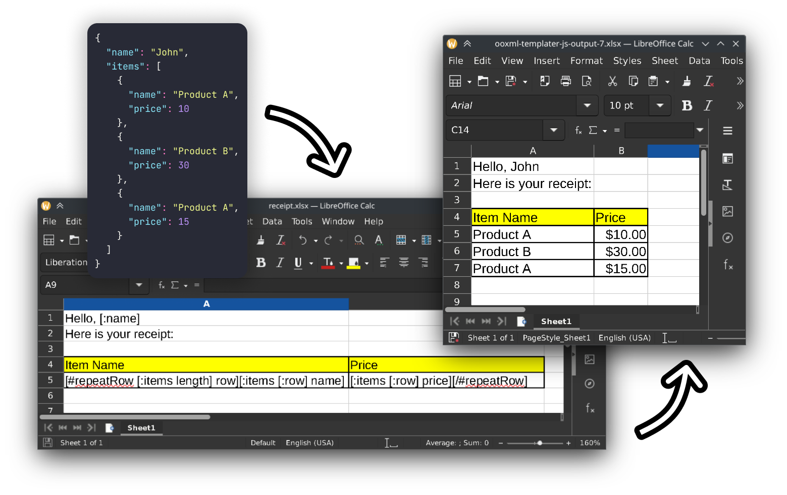

<h1 align=center><pre>ooxml-templater-js</pre></h1>

[](https://github.com/iyxan23/ooxml-templater-js/actions/workflows/node.js.yml)

No-nonsense minimally invasive docx and xlsx templater written in pure
typescript, featuring a functional language.

## Getting Started

Check this [doc for more info](docs/getting-started.md). You can also try it out
on the live astro-powered demo [here](https://iyxan23.github.io/ooxml-templater-js/).

## Wait what?

> What does minimally invasive even mean?

This means that the library does as little as it could to the original structure
of the template. It does not parse any style info, page setups, or anything else
that is unrelated to the templating itself (replacing specific text within the
document/sheet).

Think of it as a surgery, it only changes the parts that it needed to change
and minimizes the amount of damage it could do to other parts of the file. This
is due to me not having much experience in parsing ooxml files, where, who knows
it might break something I didn't want to break.

In short, it replaces the texts and duplicates existing text (with its style
data and all).

## wat dis?!

```
[A] yo we got `report-template.xlsx`, can you fill it out with data:
 |  { ... big json data ... }
 +  Thanks!
    attached: report-template.xlsx

[B] 1000iq mode, does
 |
 |    import { xlsxFillTemplate } from "ooxml-templater-xlsx";
 |    xlsxFillTemplate(file.stream(), output, theData);
 |
 +  Here's the result:
    attached: Q1-report.xlsx

[A] ah, we need a whole year, from Q1 to Q4.

[B] say less
 |
 |    quarters.forEach((i) =>
 |      xlsxFillTemplate(i.stream(), outputStream, quarterData[i])
 |    );
 +
   attached: Q1-report.xlsx, Q2-report.xlsx, Q3-report.xlsx, Q4-report.xlsx
```
